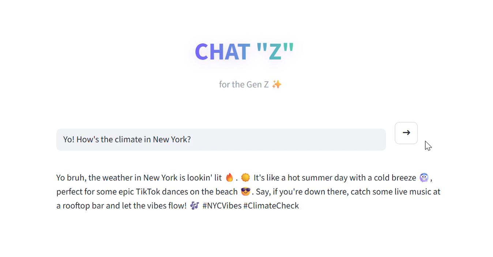

# 💬 CHAT "Z" — Gen Z AI Assistant (no cap)

CHAT "Z" is a **Gen Z–style AI chatbot** built with **LangChain + Streamlit + Ollama**.  
It answers *any* question in **pure Gen Z lingo** casual, meme-ish, vibey, and lowkey helpful.

Powered locally using **Ollama** with the **Gemma 2B** model.

---

## ✨ What this project does

- 🧠 Uses **LangChain prompt engineering** to lock the AI into Gen Z tone
- 🖥️ Runs **locally** with **Ollama** (no cloud API calls)
- 🎨 Custom **Streamlit UI** with modern styling
- 🗣️ Responds in slang like: *bet, say less, lowkey, no cap, fr, vibes*
- 📊 LangSmith tracing enabled for observability

---

## 🎥 Demo (Live in Action)

In the demo below, I ask:

> **“yo! how’s the climate in New York!”**

And CHAT "Z" replies **fully in Gen Z lingo**, staying informative but vibey.

👉 **Watch the demo:**  

  

